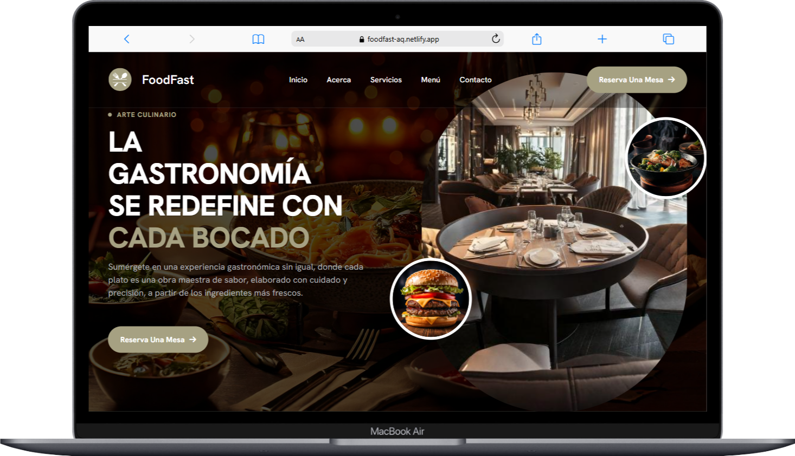
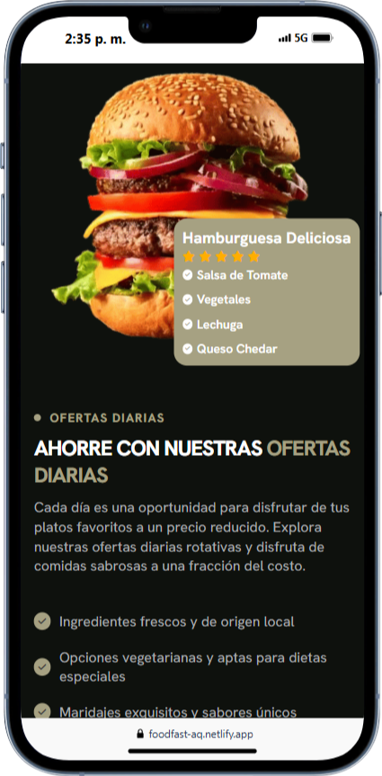

# 🌟 FoodFast - Plantilla Estática para Restaurantes 🍽️

📢 **Bienvenido/a a FoodFast**, una plantilla web estática para restaurantes creada con **HTML, CSS y JavaScript puro**. Este proyecto forma parte de un **tutorial de YouTube**, donde aprenderás a construir una página web moderna con diseño responsivo.

<p align="center">
  
  <br>
  <br>
  <br>
  
  
  
</p>

## 📺 Tutorial en YouTube 🎬

Sigue el paso a paso en mi canal de YouTube para aprender a crear la página de esta plantilla desde cero.

🔗 **[Ver tutorial en YouTube](https://www.youtube.com/@programacionparaelmundo)**

---

## 🌐 **Demostración en Vivo**

¿Quieres ver la plantilla en acción antes de descargarla?

🔗 **[Ver Demo en Vivo](https://foodfast-aq.netlify.app)**

## 🚀 **Características**

✔️ Diseño responsivo y adaptable para dispositivos móviles
✔️ Animaciones suaves con CSS  
✔️ Menú de navegación interactivo  
✔️ Secciones personalizables (Inicio, Menú, Reservaciones, Contacto)  
✔️ FAQ interactivo con JavaScript

---

## 📂 **Estructura del Proyecto**

```bash
📦 foodfast/
 ┣ 📂 images/         # Recursos de imágenes
 ┣ 📂 css/            # Estilos CSS
 ┣ 📂 js/             # Scripts JavaScript
 ┣ 📜 index.html      # Página principal
```

## 💻 Cómo Usarlo

1. Descargar el código fuente

```bash
git clone https://github.com/roberto-aq/foodfast_static.git
```

2. Abrir index.html en el navegador
3. Personalizar el contenido con tu información
4. Disfrutar de una plantilla lista para usar 🚀

## Obtén el Código Completo

Si deseas obtener el código fuente completo con archivos organizados y optimizados, puedes apoyarme comprándolo en Buy Me a Coffee.
☕ **[Comprar el código completo](https://buymeacoffee.com/roberto.aq/e/384078)**

🛠 Tecnologías Utilizadas

- HTML5
- CSS3 Moderno (Flexbox y Grid, Anidamiento, Variables)
- JavaScript
- FontAwesome
- Google Fonts
